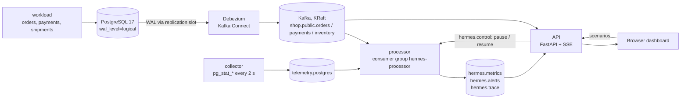

# Hermes: live database telemetry on Kafka

Hermes streams every change in a PostgreSQL database through **Debezium** and **Apache Kafka** to a live dashboard,
and turns the stream into latency metrics and alerts. Visitors can poke the system: place an order and trace it hop
by hop, start a blocking chain on a hot row, hold a long transaction, or pause the consumer and watch lag build and
drain.

**Live demo:** https://d1ykr2itxottxz.cloudfront.net


## What it shows

- **Change data capture from the WAL.** Debezium reads committed changes through a logical replication slot
  (`pgoutput`). With `REPLICA IDENTITY FULL`, updates carry full before and after images of the row.
- **Partitioned topics and consumer groups.** There is one topic per table with three partitions, keyed by
  primary key. The dashboard shows per-partition offsets and consumer lag, computed as the log-end offset minus
  the group's committed offset.
- **Stream processing.** Every second, a Python consumer computes:
  - commit→capture, capture→process and end-to-end latency percentiles
  - an order funnel
  - throughput against a rolling baseline
- **Alerting with hysteresis.** These rules open once and resolve once:
  - blocking chains
  - long transactions that pin the xmin horizon
  - replication slot lag
  - XID age
  - throughput drops
- **Observability of the pipeline itself.** A collector publishes PostgreSQL health snapshots (sessions, blockers,
  oldest transaction, slot lag, dead tuples) to Kafka alongside the change events.

## Architecture



| Container | Role |
|---|---|
| `postgres` | PostgreSQL 17 with logical decoding. The schema and seed data are in `postgres/init.sql`. |
| `kafka` | Single-node Kafka in KRaft mode (no ZooKeeper). |
| `connect` + `connect-init` | Kafka Connect with the Debezium PostgreSQL connector. The connector config is in `connect/shop-postgres.json`. |
| `workload` | Steady OLTP traffic, about 4 transactions/s. Product 1 is a deliberately hot row. |
| `collector` | Polls `pg_stat_activity`, `pg_stat_database`, `pg_replication_slots` and related views, then publishes snapshots. |
| `processor` | Consumes CDC and telemetry, then publishes metrics, alerts and traces once a second. |
| `api` | Streams state to browsers over server-sent events, runs the visitor scenarios, and serves the React dashboard. |

## Run it locally

You need Docker with Compose and about 3 GB of free memory.

```bash
git clone https://github.com/EvanElijahSQL99/hermes-kafka-cdc.git
cd hermes-kafka-cdc
docker compose up -d --build
open http://localhost:8080        # Debezium takes about a minute before the first events arrive
```

Useful commands:

```bash
docker compose logs -f processor                       # alerts as they open and resolve
docker compose exec kafka /kafka/bin/kafka-consumer-groups.sh \
  --bootstrap-server kafka:9092 --describe --group hermes-processor
docker compose exec connect curl -s localhost:8083/connectors/shop-postgres/status   # connector health
docker compose down -v                                  # stop and delete the data
```

To work on the dashboard without Docker, run `cd ui && npm install && npm run dev` and open
`http://localhost:5173/?mock`. That runs the page against an in-browser simulator.

## Tests

The stream-processing logic is pure Python, so it is unit-tested without Kafka. The database tests run the schema,
workload, collector SQL and the demo scenarios against a real PostgreSQL.

```bash
docker run -d --rm -p 55432:5432 -e POSTGRES_HOST_AUTH_METHOD=trust postgres:17 -c wal_level=logical
cd services
pip install -r requirements.txt pytest httpx
TEST_PG_ADMIN_DSN="host=127.0.0.1 port=55432 user=postgres dbname=postgres" python -m pytest -q
```

CI (`.github/workflows/ci.yml`) runs the tests, builds the dashboard, and builds the images.

## Deploy to AWS

`deploy/aws-setup.sh` runs in AWS CloudShell and creates:

- one `t3.medium` (Amazon Linux 2023) running the compose stack, with an Elastic IP
- a security group that admits HTTP **only from CloudFront's origin-facing ranges**
- an IAM role for Systems Manager (no SSH keys or open port 22)
- a CloudFront distribution for HTTPS

```bash
git clone https://github.com/EvanElijahSQL99/hermes-kafka-cdc.git && cd hermes-kafka-cdc
bash deploy/aws-setup.sh          # prints the https://…cloudfront.net URL
bash deploy/remote.sh 'docker ps' # run a command on the instance
bash deploy/remote.sh update      # git pull and redeploy
```

Approximate cost in us-east-2 is about $36 a month:

- the instance, about $30
- 30 GB of gp3, $2.40
- the public IPv4 address, $3.65
- CloudFront, close to free at demo traffic

## Public-demo guard rails

- Scenarios run one at a time and end on their own (25–50 s).
- Actions are rate-limited per visitor IP.
- Visitor orders use `lock_timeout`, and Postgres terminates sessions idle in a transaction after 2 minutes.
- The consumer pause is capped at 45 s.
- Kafka retains 6 hours of data, and the workload deletes shipped orders after 20 minutes. The database stays
  small indefinitely.

## Repository layout

```
connect/            Debezium connector config and registration script
deploy/             AWS setup (CloudShell) and remote helper
postgres/init.sql   shop schema + seed data
services/hermes/    workload, collector, processor, API (one Python package, one image)
services/tests/     unit and database tests
ui/                 React dashboard (Vite), hand-drawn SVG charts
```
